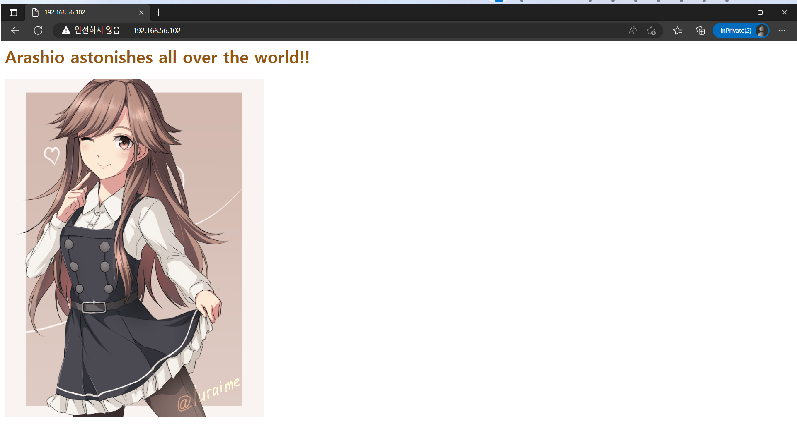

# 20230104

## 1. hostonly adapter 비활성화 문제
### i. ~~ 스크립트 파일 제작 ~~ 해결된 문제

```
vim ara.sh

#!/bin/bash
nmcli con mod enp0s8 ifname enp0s8
nmcli con up enp0s8

cp ara.sh /bin
sftp root@10.0.2.x

put ara.sh

mv /root/ara.sh /bin
```

### ii. To be

- ~~ 콘솔을 켤 때마다 실행하는 것이 아니라, 켜 놓았을 때 처음부터 사용할 수 있는 상태로 만들기 ~~ 해결됐다. [1월 6일](https://github.com/wjsuk/dailyreport/blob/main/2023-01-06.md#5-nmcli%EB%A5%BC-%EC%9D%B4%EC%9A%A9%ED%95%9C-%ED%98%B8%EC%8A%A4%ED%8A%B8-%EC%A0%84%EC%9A%A9-%EB%84%A4%ED%8A%B8%EC%9B%8C%ED%81%AC-%EC%97%B0%EA%B2%B0-%EC%9E%90%EB%8F%99%ED%99%94%EC%99%80-%EC%A3%BC%EC%9D%98%EC%82%AC%ED%95%AD)
- 콘솔을 켜는 시간 줄이기. Vagrant 등 사용 검토

## 2. Apache compile setup
### i. 컴파일 설치 사전작업

- gcc, make, gcc-c++, expat-devel 등을 설치해 둔다.

```
dnf install -y gcc make gcc-c++ expat-devel
```

### ii. 아파치 웹 서버 및 유틸리티, PCRE 패키지 입수

- 각 페이지에서 확인한 다운로드 링크와 wget 명령을 이용해 다운로드한다.

※패키지별 공식 배포 확인 페이지
아파치 웹 서버 https://httpd.apache.org/download.cgi#apache24
아파치 APR 및 util https://apr.apache.org/download.cgi
PCRE https://www.pcre.org/
※PCRE는 PCRE2 릴리즈 이후 기존 PCRE의 개발을 중단하였다. 그러나 상당수의 아파치 웹 서버에서는 기존 PCRE에 의존하고 있는 관계로 PCRE 비공식 최종버전이 공유되고 있는 중이다. 이하 실습은 전부 PCRE2가 아닌 PCRE로 실시하였다.
PCRE 비공식 최종버전 https://sourceforge.net/projects/pcre/

```
wget https://dlcdn.apache.org/httpd/httpd-2.4.54.tar.gz
wget https://dlcdn.apache.org//apr/apr-1.7.0.tar.gz
wget https://dlcdn.apache.org//apr/apr-util-1.6.1.tar.gz
wget https://jaist.dl.sourceforge.net/project/pcre/pcre/8.45/pcre-8.45.zip
```

### iii. 패키지 아카이브 및 압축파일 해제, 부속 패키지 디렉토리 이동

- 각 아카이브 압축 파일을 푼 뒤 APR, APR 디렉토리를 httpd 디렉토리의 하위 디렉토리인 srclib 디렉토리로 이동시킨다.

```
tar zxvf apr-1.7.0.tar.gz
tar zxvf apr-util-1.6.1.tar.gz
tar zxvf httpd-2.4.54.tar.gz
unzip pcre-8.45.zip
mv apr-1.7.0 httpd-2.4.54/srclib/apr
mv apr-util-1.6.1 httpd-2.4.54/srclib/apr-util
```

### iv. PCRE 패키지 설치

- PCRE 디렉토리로 이동한 뒤 configuration 스크립트 파일, make 명령, make install 명령을 수행한다.

```
cd pcre-8.45
./configure
make
make install
```

### v. 아파치 웹 서버 설치

- httpd 디렉토리로 이동한 뒤 configuration 스크립트 파일, make 명령, make install 명령을 수행한다.
- 이때 경로는 configure 스크립트 파일 실행 단계에서 prefix 옵션으로 별도 지정 가능하다. 아래 보기에서는 /usr/local/apache2로 설정하였다.
- configure 스크립트 파일 실행 실시 후 build/config_vars.mk 파일이 생성된다. 이때 'AP_LIBS'가 정의된 행의 명령 끝에 lexpat 옵션을 추가시킨다. 이 과정을 결략할 경우 에러가 발생한다.
- make 명령 실행 전에 expat-devel 패키지가 필요하다. 앞서 소개한 dnf 명령 단계에서 설치해 놓지 않았다면 설치한다. 해당 패키지가 마련돼 있지 않을 경우 make 명령 실행시 에러가 발생한다.

```
./configure --prefix=/usr/local/apache2
sed -i '/AP_LIBS/ s/-lpthread -ldl/-lpthread -ldl -lexpat/' build/config_vars.mk
make
make install
```

### vi. 아파치 웹 서버 서비스 점검 및 방화벽 해제

- 설치가 끝난 뒤 아파치 서비스를 시작시킨다.

```
/usr/local/apache2/bin/httpd -k start
```

- 아파치 서비스가 잘 구동되는지 확인하려면 다음 명령을 통해 알 수 있다.

```
ps -ef | grep httpd
netstat -anp | grep httpd
iptables -L
```

- 또한 HTTP 서비스를 방화벽 규칙에 추가시켜 준다.

```
firewall-cmd --add-service=http
```

마지막으로 네트워크 내 다른 콘솔에서 서버 접속(인바운드)이 잘 되는지 확인한다. curl 명령과 웹 서버를 설치한 IP주소를 입력해 확인한다.

```
curl 10.0.2.x
```

호스트 전용 네트워크를 연결해 둔 경우 기본적으로 호스트 전용 네트워크 IP를 호스트 콘솔의 브라우저 주소창에 입력해 웹 서버 정상구동여부를 확인 가능하다.

```
http://192.168.56.x
```

또한, 기본 패키지에 포함되어 있는 HTML 파일('It works!')대신 다른 HTML 파일로 구동확인을 하려면 다음 경로의 파일을 덮어쓴다.

```
/usr/local/apache2/htdocs/index.html
```

### vii. 구동 성공 사례 갈무리

아래 갈무리 화면은 연출이다.  

{: width="70%"}

## 3. 앤서블을 이용한 아파치 웹 서버 설치 자동화(※불완전)
### i. 사전 작업

앤서블을 구동하고 웹 서버를 설치시킬 노드를 마스터,
앤서블 구동에 의해 웹 서버가 설치될 노드를 슬레이브라고 하겠다.

마스터 노드에 앤서블을 설치시킨다. 이때 앤서블 패키지는 dnf에 직접 올라와 있지 않을 수 있으므로 확장 패키지인 epel-release를 먼저 설치시킨다.

```
dnf install epel-release -y
dnf install ansible -y
```

ssh-keygen으로 공개 키를 생성시킨 뒤, 슬레이브 노드로 해당 키를 배포한다.

```
ssh-keygen
ssh-copy-id root@(domain or IP address of slave node)
```

### ii. 앤서블 시험 작업

그리고 앤서블 설정 파일이 담긴 디렉토리로 이동하여, ansible.cfg 파일과 hosts 파일을 편집한다.
```
cd /etc/ansible
vim ansible.cfg
vim hosts
```

다음은 ansible.cfg 파일의 예제이다.
실제 앤서블 구동을 실시할 계정, 앤서블 구동에 따라 영향을 받는 슬레이브 노드의 목록 파일, 앤서블 구동시 사용자 권한 설정 등을 정의한다.
```
[defaults]
remote_user = root
inventory = /etc/ansible/hosts
roles_path = /etc/ansible/roles
host_key_checking = False

[privilege_escalation]
become = True
become_method = sudo
become_user = root
become_ask_pass = False
```

hosts 파일에는 슬레이브 노드의 도메인 또는 IP주소를 적어놓는다.

```
10.0.2.x
```

편집이 끝났으면 슬레이브 노드를 향해 통신 점검을 실시한다.

```
ansible all -m ping
```

### iii. 앤서블 구동

그동안 작업한 디렉토리로 가서 플레이북 파일을 만든다.

```
vim playbook.yaml
```

다음은 2. 에서 아파치 웹 서버를 컴파일 설치하기 위해 실시하였던 일련의 과정을 플레이북으로 작성한 예시이다.

```
- name: Compile Installing Apache web server
  hosts: all
  tasks:
          - name: Installing the packages to set up files
            dnf:
                    name: gcc
                    state: latest
          - name: Installing the packages to set up files
            dnf:
                    name: make
                    state: latest
          - name: Installing the packages to set up files
            dnf:
                    name: gcc-c++
                    state: latest
          - name: Installing the packages to set up files
            dnf:
                    name: expat-devel
                    state: latest
          - name: Making the directory of work files
            file:
                    path: /daisuki
                    state: directory
          - name: Downloading the archived-compressed packages of Apache server, APR, APR util, and PCRE
            get_url:
                    url: https://dlcdn.apache.org/httpd/httpd-2.4.54.tar.gz
                    dest: /daisuki
          - name: Downloading the archived-compressed packages of Apache server, APR, APR util, and PCRE
            get_url:
                    url: https://dlcdn.apache.org//apr/apr-1.7.0.tar.gz
                    dest: /daisuki
          - name: Downloading the archived-compressed packages of Apache server, APR, APR util, and PCRE
            get_url:
                    url: https://dlcdn.apache.org//apr/apr-util-1.6.1.tar.gz
                    dest: /daisuki
          - name: Downloading the archived-compressed packages of Apache server, APR, APR util, and PCRE
            get_url:
                    url: https://jaist.dl.sourceforge.net/project/pcre/pcre/8.45/pcre-8.45.zip
                    dest: /daisuki
          - name: Extracting the packages of Apache server, APR, APR util, and PCRE
            unarchive:
                    src: apr-1.7.0.tar.gz
                    dest: /daisuki
          - name: Extracting the packages of Apache server, APR, APR util, and PCRE
            unarchive:
                    src: apr-util-1.6.1.tar.gz
                    dest: /daisuki
          - name: Extracting the packages of Apache server, APR, APR util, and PCRE
            unarchive:
                    src: httpd-2.4.54.tar.gz
                    dest: /daisuki
          - name: Extracting the packages of Apache server, APR, APR util, and PCRE
            unarchive:
                    src: pcre-8.45.zip
                    dest: /daisuki
          - name: Moving the directories
            script:
                    cmd: /bin/mv /daisuki/apr-1.7.0 /daisuki/httpd-2.4.54/srclib/apr
          - name: Moving the directories
            script:
                    cmd: /bin/mv /daisuki/apr-util-1.6.1 /daisuki/httpd-2.4.54/srclib/apr-util
          - name: Setting up the PCRE
            script:
                    cmd: /bin/cd /daisuki/pcre-8.45
          - name: Setting up the PCRE
            script:
                    cmd: /usr/bin/sudo /bin/bash /daisuki/pcre-8.45/configure
          - name: Setting up the PCRE
            script:
                    cmd: /usr/bin/make
          - name: Setting up the PCRE
            script:
                    cmd: /usr/bin/make install
          - name: Setting up the Apache web server
            script:
                    cmd: /bin/cd /daisuki/httpd-2.4.54
          - name: Setting up the Apache web server
            script:
                    cmd: /bin/bash /daisuki/httpd-2.4.54/configure --prefix=/usr/local/apache2

```

```
- name: Compile Installing Apache web server
  hosts: all
  tasks:
          - name: Setting up the Apache web server
            script:
                    cmd: /bin/sed -i '/AP_LIBS/ s/-lpthread -ldl/-lpthread -ldl -lexpat/' /daisuki/httpd-2.4.54/build/config_vars.mk
          - name: Setting up the Apache web server
            script:
                    cmd: /usr/bin/make
          - name: Setting up the Apache web server
            script:
                    cmd: /usr/bin/make install

```

```
- name: Compile Installing Apache web server
  hosts: all
  tasks:
          - name: Turning on and Making a test of the Apache web server
            script:
                    cmd: /usr/local/apache2/bin/httpd -k start
          - name: Turning on and Making a test of the Apache web server
            script:
                    cmd: /bin/ps -ef | /bin/grep httpd
          - name: Turning on and Making a test of the Apache web server
            script:
                    cmd: /bin/netstat -anp | /bin/grep httpd
          - name: Turning on and Making a test of the Apache web server
            script:
                    cmd: /usr/sbin/iptables -L
          - name: Enabling the http service of the firewall
            script:
                    cmd: /bin/firewall-cmd --add-service=http

```


앤서블 플레이북에 필요한 모듈은 이 곳에서 확인할 수 있다.

https://docs.ansible.com/ansible/latest/collections/ansible/builtin/index.html

다 만들었으면 플레이북을 불러와서 앤서블을 구동시킨다.

```
ansible-playbook -vvv playbook.yaml
```

### iv. To be

실제 앤서블 구동 실시 결과 오류가 발생하여 슬레이브 노드에서 수동작업하였던 구간을 기재한다.
각 부분에 대한 솔루션을 찾았을 때 이상 없이 앤서블로 아파치 웹 서버를 설치시킬 수 있다.

- Apache httpd의 configure 스크립트 실행 단계에서 /build/config_vars.mk 파일을 생성하지 못하였다. 그래서 다음 명령인 sed 명령으로 -lexpat 옵션을 추가시키는 명령을 실시하지 못해 에러가 발생하였다.
- Apache httpd의 make 및 install 명령이 정상 실행되지 못하였다.

그래서 httpd 설치 단계는 수동 진행하여 통과하였다. 

## 4. 레퍼런스

https://zetawiki.com/wiki/%EC%95%84%ED%8C%8C%EC%B9%98_%EC%BB%B4%ED%8C%8C%EC%9D%BC_%EC%84%A4%EC%B9%98
https://docs.ansible.com/ansible/latest/collections/ansible/builtin/index.html