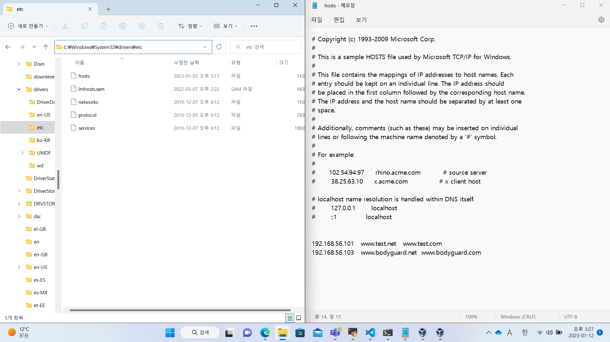
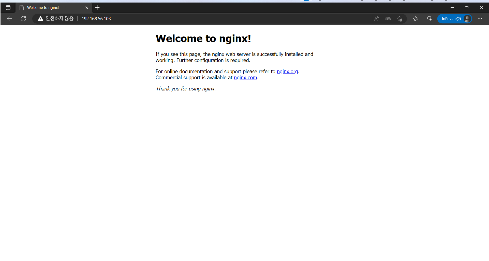

# 20230105

## 1. 한번 껐던 서버에서 아파치 웹 서버 다시 켜기

```
/usr/local/apache2/bin/httpd -k start
firewall-cmd --add-service=http
```

## 2. NT 커널에서의 /etc/hosts 파일

<center>{: width="70%"}</center>

C:\windows\system32\drivers\etc\hosts 파일이다. UNIX와 마찬가지로 확장자는 따로 없다.  
실행시에는 관리자 권한으로 열 것.

## 3. 아파치의 가상호스트 설정
### i. 정의
/etc/hosts 파일 내 같은 IP에 도메인 네임을 두 개 정의하고, 각각 다른 HTML 파일로 접속되게 하는 일.

```
192.168.56.101   www.test.com  www.test.net
```

호스트 콘솔에 위 설정을 하면, www.test.com과 www.test.net 어느 쪽으로 접속하여도 192.168.56.101로 접속됨을 확인할 수 있다.

### ii. 설정 순서
/usr/local/apache2/conf/httpd.conf 파일에서 다음에 해당하는 내용을 찾아 주석 처리를 제거한다.

```
# Virtual hosts
Include conf/extra/httpd-vhosts.conf
```

그 다음 해당 경로에 있는 파일을 찾아 다음처럼 고친다.
- ※아래에 등장하는 경로는 전부 폴더이다. 파일 경로를 정의하면 파일 확장자까지를 폴더 이름인 줄 알고 접근을 시도하다 다음과 같은 오류를 내뱉는다.

```
AH00112: Warning: DocumentRoot [/usr/local/apache2/htdocs/arashio.html] does not exist
AH00112: Warning: DocumentRoot [/usr/local/apache2/htdocs/goldeneagle.html] does not exist
```

그러므로 별도의 index.html 파일은 뒤에 쓰지 않도록 주의하라.

```
<VirtualHost *:80>
    DocumentRoot "/usr/local/apache2/vhtml/arashio/docbase"
    ServerName www.test.com
</VirtualHost>

<VirtualHost *:80>
    DocumentRoot "/usr/local/apache2/vhtml/goldeneagle/docbase"
    ServerName www.test.net
</VirtualHost>
```

그리고 /usr/local/apache2/conf/httpd.conf 파일에 다음 내용을 추가한다.

```
DocumentRoot "/usr/local/apache2/vhtml/arashio/docbase"
<Directory "/usr/local/apache2/vhtml/arashio/docbase">
    Require all granted
</Directory>


DocumentRoot "/usr/local/apache2/vhtml/goldeneagle/docbase"
<Directory "/usr/local/apache2/vhtml/goldeneagle/docbase">
    Require all granted
</Directory>
```

단 아파치 서버 버전 2.3 버전 이하라면 이 방법으로 한다. 예전에 가상호스트 권한을 줄 때 쓰던 구문이다.

```
DocumentRoot "/usr/local/apache2/vhtml/arashio/docbase"
<Directory "/usr/local/apache2/vhtml/arashio/docbase">
    Order Allow,Deny
    Allow from all
</Directory>


DocumentRoot "/usr/local/apache2/vhtml/goldeneagle/docbase"
<Directory "/usr/local/apache2/vhtml/goldeneagle/docbase">
    Order Allow,Deny
    Allow from all
</Directory>
```

그리고 당연히, 위에 정의한 계정에 각각 index.html 파일을 마련해 둔다.

그 다음 웹 서버가 이미 구동되어 있다면 다음 명령으로 서버를 재시작시킨다.

/usr/local/apache2/bin/httpd -k restart

만약 한쪽 도메인 네임으로 권한 오류 메시지가 난다면 apache2 디렉토리의 logs/error_log 파일을 확인한다.

httpd.conf 파일의 디렉토리 권한 부여 설정을 2.3 이하 버전의 방식으로 적어두고 2.4 버전에서 구동했다면,  
이런 오류구문이 나오고 페이지 접근이 안 될 것이다.

```
[Thu Jan 05 10:47:50.902523 2023] [authz_core:error] [pid 6089:tid 140037576406784] [client 192.168.56.1:51052] AH01630: client denied by server configuration: /usr/local/apache2/vhtml/goldeneagle/docbase/
```

그러므로 버전에 맞는 명령어 구문을 잘 파악하고 작성하라.

### iii. Apache 가상 호스트 페이지 분리 성공 사례 갈무리

가상 호스트별 메인 페이지는 연출이다.

<center>{: width="70%"}</center>


### iv. 레퍼런스

https://cornswrold.tistory.com/348  
https://server-talk.tistory.com/3  
https://meongj-devlog.tistory.com/94  
https://bloodguy.tistory.com/entry/Apache-24-%EB%B2%84%EC%A0%84%EC%97%90%EC%84%9C-403-%EC%97%90%EB%9F%AC%EC%8B%9C-authzcoreerror-AH01630-client-denied-by-server-configuration

## 4. Nginx Compile Setup
### i. 컴파일 설치 사전작업
gcc, gcc-c++, make 등이 필요하다.

```
dnf install gcc gcc-c++ make -y
```

### ii. Nginx 및 의존성 패키지 입수

Nginx는 Stable version의 설치가 권장된다.  
그 외 버전은 베타 버전이 아닌 최신 버전을 다운로드하였다. 

※패키지별 공식 배포 확인 페이지  
Nginx http://nginx.org/en/download.html  
PCRE 1월 4일 자료 참조  
Zlib http://zlib.net/  
openssl http://www.openssl.org/source/ 메이저 버전이 1로 시작하는 것을 사용한다.  

```
wget http://nginx.org/download/nginx-1.22.1.tar.gz
wget http://zlib.net/zlib-1.2.13.tar.gz
wget https://www.openssl.org/source/openssl-1.1.1s.tar.gz
```

### iii. 패키지 아카이브 및 압축 해제

각 아카이브 압축 파일을 풀어 둔다.

```
tar zxvf nginx-1.22.1.tar.gz
tar zxvf zlib-1.2.13.tar.gz
tar zxvf openssl-1.1.1s.tar.gz
```

### iv. (※생략 가능) Zlib, Openssl 패키지 설치
Zlib 디렉토리로 이동한 뒤 configure 스크립트 파일, make, make install 명령을 수행한다.

 ```
 cd zlib-1.2.13
 ./configure
 make
 make install
 cd ../openssl-1.1.1s
 ./config
 make
 make install
 ```

### v. Nginx 설치
설치에 앞서 Nginx 구동을 담당할 사용자 계정을 생성한다.  
이 계정은 오직 Nginx의 설치 및 구동에만 사용되며 로그인이 필요하지 않으므로 셸 로그인을 차단시킬 것이다.

```
useradd --shell /usr/sbin/nologin youjinbou

youjinbou 대신 nginx라는 계정으로 설정하는 것이 일반적이다.
※youjinbou(일 ようじんぼう; 漢 用心棒)란 파수꾼 또는 자경을 위해 쓰는 곤봉을 의미한다.
```

그 다음 nginx를 설치한 폴더로 들어가, configure 스크립트 파일을 실행한다.  
실행에 앞서 옵션으로 설정해 둘 사안을 세심하게 지정하여 실행시킨다.

```
./configure \
--prefix=/usr/local/nginx \
--sbin-path=/usr/local/nginx/sbin/nginx \
--conf-path=/usr/local/nginx/conf/nginx.conf \
--pid-path=/usr/local/nginx/iroha/nginx.pid \
--lock-path=/usr/local/nginx/iroha/nginx.lock \
--error-log-path=/usr/local/nginx/logs/error.log \
--http-log-path=/usr/local/nginx/logs/access.log \
--with-zlib=/daisuki/zlib-1.2.13 \
--with-pcre=/daisuki/pcre-8.45 \
--with-openssl=/daisuki/openssl-1.1.1s \
--with-http_ssl_module \
--with-debug \
--user=youjinbou \
--group=youjinbou
```

성공적으로 끝났다면 make, make install 명령을 사용해 설치과정을 끝낸다.

```
make
make install
```

### vi. 충돌 방지 작업 및 Nginx 웹 서버 서비스 점검

먼저 다음 두 가지 중 하나를 수행한다. 

#### **선택 1**: 아파치 웹 서버와 Nginx 서버를 공존시키고자 할 때 

Nginx의 포트를 바꾸려면, 수신하는 포트 번호를 80에서 다른 http 포트로 바꾼다.

```
vim /usr/local/nginx/conf/nginx.conf

(전략)

    server {
        listen       8008;
        server_name  localhost;

(후략)
```

물론 Apache 측의 포트를 바꿔도 된다. 

```
vim /usr/local/apache2/conf/httpd.conf

(전략)
#
#Listen 12.34.56.78:80
Listen 8008

#
# Dynamic Shared Object (DSO) Support
(후략)
```

시스템상 http 포트로 사용 가능한 포트 번호 및 프로토콜은 다음 명령으로 확인할 수 있다.

```
semanage port --list | grep http
```

그리고 포트 80 대신 정의한 포트 번호를 방화벽 규칙에 추가시킨다.

```
firewall-cmd --add-port=8008/tcp
```

#### **선택 2**: 아파치 웹 서버를 끄고 80 포트 신호를 Nginx로만 받고자 할 때

아파치 서비스를 종료시킨다.

```
/usr/local/apache2/bin/httpd -k stop
```

#### 공통:**충돌 방지 작업 종료 후**

Nginx 서비스를 다음 명령어로 시작시킨다.

```
/usr/local/nginx/sbin/nginx
```

#### 만약 Apache와 Nginx 어느 쪽도 포트 충돌 방지 조치를 하지 __않고__ 서비스를 시작하려 들면 어떻게 될까?

Nginx가 가동되는 도중에 Apache 웹 서버를 켜면 이런 에러 메시지가 나온다.

```
(98)Address already in use: AH00072: make_sock: could not bind to address [::]:80
(98)Address already in use: AH00072: make_sock: could not bind to address 0.0.0.0:80
no listening sockets available, shutting down
AH00015: Unable to open logs
```

반대로 Apache 웹 서버 가동 중에 Nginx 웹 서버를 켜면 이렇게 된다.

```
nginx: [emerg] bind() to 0.0.0.0:80 failed (98: Address already in use)
nginx: [emerg] bind() to 0.0.0.0:80 failed (98: Address already in use)
nginx: [emerg] bind() to 0.0.0.0:80 failed (98: Address already in use)
nginx: [emerg] bind() to 0.0.0.0:80 failed (98: Address already in use)
nginx: [emerg] bind() to 0.0.0.0:80 failed (98: Address already in use)
nginx: [emerg] still could not bind()
```

그러므로 둘을 동시에 설치한 뒤에 어느 한쪽 이상을 구동시키려면 **꼭 포트 번호 충돌 조치를 마쳐놓고** 구동시키자!

### vii. 구동 성공 사례 갈무리

<center>{: width="70%"}</center>

## 5. 앤서블을 이용한 Nginx 설치 자동화(※불완전)

사전 작업 및 앤서블 시험 작업은 전일 문서를 참조.

### i. 앤서블 구동

다음은 Nginx를 컴파일 설치하기 위해 실시하였던 일련의 과정을 플레이북으로 작성한 예시이다.  
Apache와의 충돌 방지 처리는 Apache 서버를 끄는 것을 채택해 구동하였다.  
주석으로 쓴 것은 실제 구동시 오류 발생으로 강제종료되어, 실제로 설치할 때는 슬레이브 노드에 수동입력해야 했던 부분이자 To-be 대상 태스크이다. 그 외 실제 의도를 벗어난 결과를 얻은 경우 별도 주석을 달았다.

```
- name: Compile Installing Nginx web server
  hosts: all
  tasks:
          - name: Downloading the archived-compressed packages of Nginx server
            get_url:
                    url: https://nginx.org/download/nginx-1.22.1.tar.gz
                    dest: /daisuki
          - name: Downloading the archived-compressed packages of Zlib
            get_url:
                    url: https://zlib.net/zlib-1.2.13.tar.gz
                    dest: /daisuki
          - name: Downloading the archived-compressed packages of Openssl
            get_url:
                    url: https://www.openssl.org/source/openssl-1.1.1s.tar.gz
                    dest: /daisuki
          - name: Downloading the archived-compressed packages of PCRE
            get_url:
                    url: https://jaist.dl.sourceforge.net/project/pcre/pcre/8.45/pcre-8.45.zip
                    dest: /daisuki
          - name: Extracting the packages of Nginx server
            unarchive:
                    src: nginx-1.22.1.tar.gz
                    dest: /daisuki
          - name: Extracting the packages of Zlib
            unarchive:
                    src: zlib-1.2.13.tar.gz
                    dest: /daisuki
          - name: Extracting the packages of Openssl
            unarchive:
                    src: openssl-1.1.1s.tar.gz
                    dest: /daisuki
          - name: Extracting the packages of PCRE
            unarchive:
                    src: pcre-8.45.zip
                    dest: /daisuki
          - name: Singing up the account for Nginx building only
            user:
                    name: youjinbou
                    shell: /usr/sbin/nologin
          - name: Setting up the Nginx web server - Changing directory to Nginx
            script:
                    cmd: /bin/cd /daisuki/nginx-1.22.1
          ## - name: Setting up the Nginx web server - Configuring
          ## script:
          ##          cmd: /bin/bash -c "/daisuki/nginx-1.22.1/configure --prefix=/usr/local/nginx --sbin-path=/usr/local/nginx/sbin/nginx --conf-path=/usr/local/nginx/conf/nginx.conf --pid-path=/usr/local/nginx/iroha/nginx.pid --lock-path=/usr/local/nginx/iroha/nginx.lock --error-log-path=/usr/local/nginx/logs/error.log --http-log-path=/usr/local/nginx/logs/access.log --with-zlib=/daisuki/zlib-1.2.13 --with-pcre=/daisuki/pcre-8.45 --with-openssl=/daisuki/openssl-1.1.1s --with-http_ssl_module --with-debug --user=youjinbou --group=youjinbou"
          ## - name: Setting up the Nginx web server - Making
          ##  script:
          ##          cmd: /usr/bin/make
          ## - name: Setting up the Nginx web server - Making install
          ##  script:
          ##          cmd: /usr/bin/make install
          - name: Turning off the Apache web server
            script:
                    cmd: /usr/local/apache2/bin/httpd -k stop
          - name: Turning on the Nginx web server
            script:
                    cmd: /bin/local/nginx/sbin/nginx ## 실제로는 켜지지 않았다. 그래서 이후에 입력한 태스크 명령 모두 정상작동하지 않는다.
          ## - name: Making a test of the Nginx web server
          ##  script:
          ##          cmd: /bin/netstat -anp | /bin/grep nginx
          ## - name: Making a test of the Nginx web server
          ##  script:
          ##          cmd: /bin/iptables -L
          ## - name: Enabling the http service of the firewall
          ##  script:
          ##          cmd: /bin/firewall-cmd --add-service=http

```

### ii. To be

- Nginx를 직접 설치하는 configure 스크립트, make 명령, make install 명령 모두 정상작동하지 않았다. 이것을 정상작동하게끔 하여야 한다.
- Nginx 설치 후 스크립트 파일 /usr/local/nginx/sbin/nginx 로 서비스를 켜는 명령이 실제로 실시되지 않아서, 다음 명령인 서비스 정상작동 확인 명령을 하나도 진행시킬 수 없었다. 아파치 서버 스크립트 파일인 /usr/local/apache2/bin/httpd 파일은 잘 작동하였던 것과 대조된다.