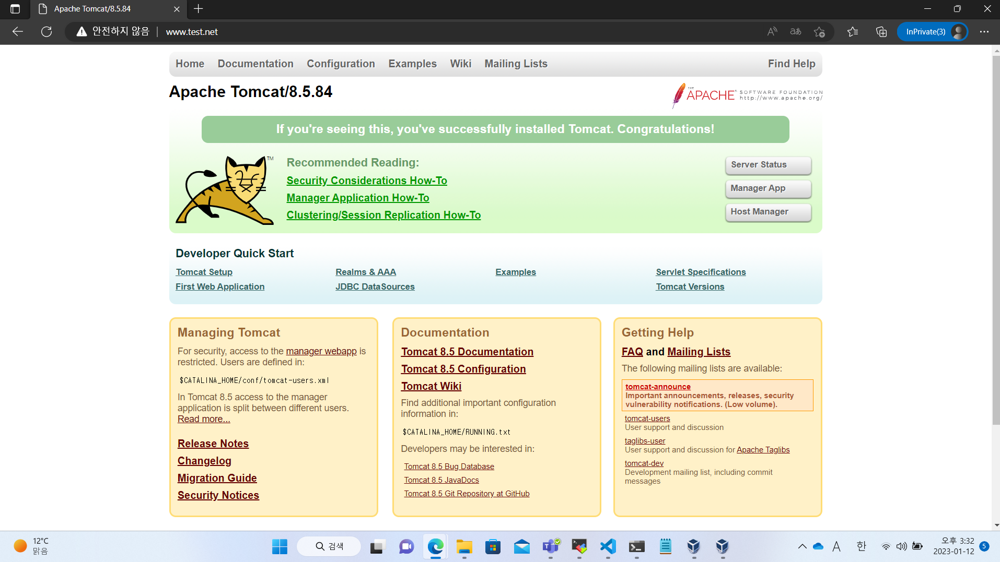
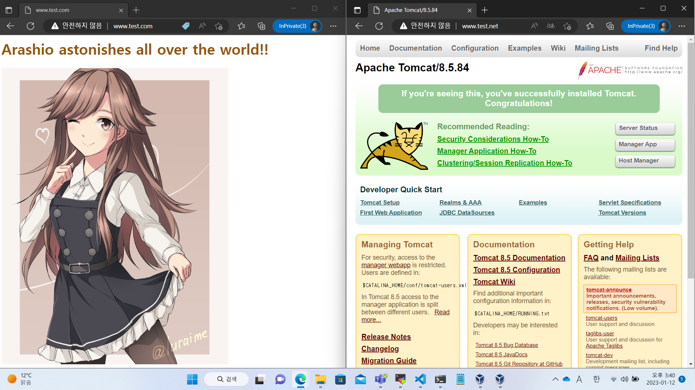

# 20230106

## 1. 한번 껐던 서버에서 Nginx 웹 서버 다시 켜기

```bash
/usr/local/nginx/sbin/nginx
firewall-cmd --add-service=http

# 다른 포트로 Nginx 웹 서버를 구동시켰을 경우
firewall-cmd --add-port=(포트 번호)/(프로토콜 소문자로)
```

## 2. Nginx 웹 서버의 구동 설정 옵션

아무 옵션도 넣지 않으면 구동을 시작한다.  
- -t 옵션: conf/nginx.conf 문서의 이상유무를 점검한다.  
- -s stop: 구동을 종료한다.  
- -s reload: nginx.conf 문서 등의 설정을 바꾸고 적용시킬 때 사용하는 옵션. 변경사항을 반영하여 구동을 재시작한다.  

## 3. Nginx의 서버 블럭 설정
### i. 정의
/etc/hosts 파일 내 같은 IP에 도메인 네임을 두 개 정의하고, 각각 다른 HTML 파일로 접속되게 하는 일.
즉 <span style="background-color:yellow;">[Apache 웹 서버의 가상 호스트 설정](https://github.com/wjsuk/dailyreport/blob/main/2023-01-05.md#3-%EC%95%84%ED%8C%8C%EC%B9%98%EC%9D%98-%EA%B0%80%EC%83%81%ED%98%B8%EC%8A%A4%ED%8A%B8-%EC%84%A4%EC%A0%95)</span>과 유사한 개념이다.

```
192.168.56.103   www.bodyguard.com  www.bodyguard.net
```

호스트 콘솔에서, www.bodyguard.com 과 www.bodyguard.net 어느 쪽으로 접속하여도 192.168.56.103으로 접속하되,  
각기 다른 웹 페이지로 리다이렉트시키고자 할 때 conf/nginx.conf 파일에 설정하는 중괄호 블럭을 의미한다.

/usr/local/nginx/conf/nginx.conf 파일에서  
**server** 라는 이름을 갖고 **중괄호**로 묶인 다음의 블록을 찾을 수 있다.

```
    server {
        listen       80;
        server_name  localhost;

        ## 중략 ##
        
        #location ~ /\.ht {
        #    deny  all;
        #}
    }
```

이곳에 정의된 내용과 그 블록을 **서버 블럭**이라고 한다.  
처음 nginx.conf 파일에 정의되어 있는 위 서버 블럭은 인바운드로 들어온 통신에 제공하는 **기본값 서비스**가 된다.

바로 이와 같은 블럭을 도메인 이름에 맞춰 따로 마련해 두면 **도메인 이름별 별개 서비스**를 제공할 수 있다.
아파치 웹 서버의 _가상 호스트 기능_과 유사하게.

### ii. 설정 순서

#### 웹 서비스 파일 제작

nginx 하위 디렉터리에 접속시킬 도메인 이름으로 된 디렉터리를 만든다.  
또 하위 디렉터리로 정적 웹 파일을 저장할 디렉터리를 마련한다. 

```bash
mkdir -p bodyguard.net/html
```

해당 디렉터리에는 메인 페이지로 제공할 HTML 파일을 만들어 둔다.

#### 웹 서비스 파일 권한 설정

그리고 도메인 이름 디렉터리 내 컨텐츠 일체의 권한을 전 사용자 실행 가능토록 바꾼다.

```bash
chmod -R a+x bodyguard.net
```

#### conf/nginx.conf 파일 수정

그 다음 conf/nginx.conf에서 i. 에 소개한 부분 바로 아랫줄에 다음과 같은 블럭을 신규작성한다.

```
    server {
        server_name bodyguard.net www.bodyguard.net;
        access_log logs/bodyguard.net.log main;
        error_log logs/bodyguard.net.error.log;

        root /usr/local/nginx/bodyguard.net/html;
        index index.html index.htm;

        location / {
            try_files $uri $uri/ =404;
        }
    }
```

블럭 내 문장은 다음을 의미한다.  

- server_name: 접속시킬 도메인 이름을 정의한다.
- access_log: 해당 서버 블록으로의 로그 파일을 저장할 경로를 정의한다. 뒤에는 nginx.conf 파일 내에 정의한 로그 파일 양식을 쓴다.
- error_log: 해당 서버 블록으로의 에러 로그 파일을 저장할 경로를 정의한다.
- root: 제공할 웹 서비스 파일이 있는 경로를 정의한다.
- index: 제공할 웹 서비스의 메인 페이지 파일 이름을 정의한다.
- location 블럭: 도메인 내 하위 도메인(/ 우측의)에 대한 블럭이다. 위에서는 루트 폴더 내 다른 파일이 있는지 찾은 뒤 없을 경우 404 에러 메시지를 송신하도록 정의하였다.

도메인 이름 및 제공할 웹 서비스가 여러개라면 위와 같은 블럭을 계속해서 작성한다.

#### access_log 옵션의 main 양식 활성화

서버 블럭 내 다음과 같은 문장을 찾을 수 있다.

```
access_log logs/bodyguard.net.log main;
```

서버 로그 파일을 main이라는 양식으로 저장하라는 명령이다.  
이것은 conf/nginx.conf 파일 내 주석 처리되어 마련된 부분을 활성화시켜야 사용 가능하다.

```
log_format main '$remote_addr - $remote_user [$time_local] "$request" '
'$status $body_bytes_sent "$http_referer" '
'"$http_user_agent" "$http_x_forwarded_for"';
```

이 부분이 문장 첫머리마다 # 이 붙어 비활성화되어 있는데 #을 제거해 활성화하면 main 양식을 쓸 수 있다.
만약 이 양식을 원치 않는다면 다음과 같이 main 양식을 생략한다.

```
access_log logs/bodyguard.net.log;
```

#### Nginx 서버 재구동

```bash
/usr/local/nginx/sbin/nginx -t
/usr/local/nginx/sbin/nginx -s reload
```

이상의 과정을 마치면 이제 도메인 이름에 따라 다른 서버 블럭의 웹 서비스를 공급하는 것을 확인 가능하다.

#### 서버 콘솔을 끄고 다시 Nginx 서버를 구동해야 한다면

Nginx 구동 후 방화벽 설정으로 http 인바운드 규칙을 추가하는 것을 잊지 말 것.
사실 이건 아파치 웹 서버 가상 호스트 기능에서도 마찬가지이다.

### iii. Nginx 서버 블록 분리 성공 사례 갈무리

서버 블록별 메인 페이지는 연출이다.


### iv. 레퍼런스

https://ja.linux-console.net/?p=1025#gsc.tab=0  
https://mogile.web.fc2.com/nginx_wiki/start/topics/examples/server_blocks/  
https://codewithkarani.com/2022/08/03/unknown-log-format-main-nginx/  
https://velog.io/@pinot/nginx-%ED%8F%AC%ED%8A%B8%ED%8F%AC%EC%9B%8C%EB%94%A9%EC%97%90-%EB%8C%80%ED%95%98%EC%97%AC-%EC%95%8C%EC%95%84%EB%B3%B4%EC%9E%90

## 4. 환경변수 설정으로 각 애플리케이션 실행시 경로 생략시키기
### i. 개요 및 방법

```
export APACHE2_HOME=/usr/local/apache2
export NGINX_HOME=/usr/local/nginx
export PATH=$PATH:$APACHE2_HOME/bin:$NGINX_HOME/sbin:
```

PATH 환경변수는 바이너리 파일이 그의 경로 없이 실행될 수 있게 하는 변수이다. 내장 바이너리 파일의 원래 경로가 값으로 저장돼 있다.  
계속해서 경로 생략 실행을 시키고 싶은 바이너리 파일 경로를 추가시키고 싶다면 맨 처음을 $PATH: 로 시작해 기존 값과 새로 추가시킬 값을 묶는다. 그리고 새로 추가시킬 값들을 콜론(:)구분자로 계속 이어서 쓰면 된다.

단 export 명령을 셸에 직접 입력하는 방식은 휘발성을 가진다. 즉 로그아웃 후엔 사라진다.  
이를 방지하기 위해서는 .bashrc 파일에 항상 쓰려는 환경변수를 정의해 두어야 한다. 

```bash
vim ~/.bashrc
```
```
(문서 최하단에)
export APACHE2_HOME=/usr/local/apache2
export NGINX_HOME=/usr/local/nginx
export PATH=$PATH:$APACHE2_HOME/bin:$NGINX_HOME/sbin:

source ~/.bashrc
```
### ii. 레퍼런스
https://servermon.tistory.com/245  
https://byeonely.tistory.com/59#recentComments  

## 5. nmcli를 이용한 호스트 전용 네트워크 연결 자동화와 주의사항

```bash
nmcli con mod enp0s8 connection.autoconnect yes
nmcli con up enp0s8
```

[1월 4일 자료 참조.](https://github.com/wjsuk/dailyreport/blob/main/2023-01-04.md#1-hostonly-adapter-%EB%B9%84%ED%99%9C%EC%84%B1%ED%99%94-%EB%AC%B8%EC%A0%9C)  
ara.sh 스크립트 파일을 실행시킬 필요가 없어졌다.

참고로 nmcli 명령으로 다른 설정을 함부로 만지면,  
(ipv4.method를 manual로 바꾸는 등)  
<span style="color:red; font-size:30;">**애써서 구현한 가상호스트-서버블럭을 못쓰게 된다!**</span>  

그러므로 함부로 nmcli 명령에 손 대지 <U>않도록<U> 주의하자.

## 6. Tomcat Compile Install
### i. Tomcat 및 의존성 패키지 입수

Tomcat 이외에 자바 프로그램인 JDK를 설치하여야 한다.

※패키지별 공식 배포 확인 페이지  
Tomcat https://tomcat.apache.org/download-80.cgi  
JDK https://www.oracle.com/java/technologies/downloads/#java19  

```bash
wget https://dlcdn.apache.org/tomcat/tomcat-8/v8.5.84/bin/apache-tomcat-8.5.84.tar.gz
wget https://download.oracle.com/java/19/latest/jdk-19_linux-x64_bin.tar.gz
```

### ii. 패키지 아카이브 및 압축 해제

각 아카이브 압축 파일을 풀어 둔다.

```bash
tar -zxvf apache-tomcat-8.5.84.tar.gz
tar -zxvf jdk-19_linux-x64_bin.tar.gz
```

### iii. JDK 디렉토리 배치 및 환경변수 지정
#### JDK 디렉토리 배치
JDK 패키지는 별도의 설치과정이 없다.  
아카이브 압축 파일을 풀어 나온 디렉토리를 원하는 곳에 그대로 가져다 쓰면 된다.  

 ```bash
mv jdk-19.0.1 /usr/local/jdk
 ```

#### JDK 바이너리 파일 환경변수 지정

~/.bashrc 파일에 jdk 디렉토리를 환경변수로 지정해 두면,  
앞으로 아무 데서나 자바 프로그래밍 소스코드를 컴파일(javac)/실행(java)시킬 수 있다.  
다음 과정인 Tomcat 구동에 필요하기에 순서상 필수과정으로 적어 두었다. 

```bash
vim ~/.bashrc
```
```
(전략)
export JAVA_HOME=/usr/local/jdk
(중략)
export PATH=$PATH:(중략):$JAVA_HOME/bin
```
```bash
source ~/.bashrc 
```

### iv. Tomcat 파일 구성
#### Tomcat 디렉터리 이동
Tomcat 또한 별도의 설치 과정을 요하지 않는다.  
JDK처럼 Tomcat의 아카이브 압축 파일을 풀어 나온 디렉터리를 원하는 곳에 배치한 뒤 작업을 시작한다.  

```bash
mv apache-tomcat-8.5.84 /usr/local/tomcat
```

#### Tomcat 설정 파일 조정
그리고 새로 바꾼 디렉터리의 하위 디렉토리 conf로 가서 server.xml 파일을 연다.  
그곳에서 커넥터 연결 설정을 찾아서, 포트 번호를 적어 두고 URI 인코딩 설정을 추가한다.   

```bash
vim conf/server.xml
```
```xml
(전략)
    <Connector port="8080" protocol="HTTP/1.1"
               URIEncoding="UTF-8" 
<!-- ↑이 바로 위 문장이 추가된 URI 인코딩 설정이다. -->
               connectionTimeout="20000"
(후략)
```

#### Tomcat 실행
그 다음 bin 디렉토리의 startup.sh 스크립트 파일을 실행한다.

```
Using CATALINA_BASE:   /usr/local/tomcat
Using CATALINA_HOME:   /usr/local/tomcat
Using CATALINA_TMPDIR: /usr/local/tomcat/temp
Using JRE_HOME:        /usr/local/jdk
Using CLASSPATH:       /usr/local/tomcat/bin/bootstrap.jar:/usr/local/tomcat/bin/tomcat-juli.jar
Using CATALINA_OPTS:
Tomcat started.
```

그러면 다음과 같은 실행 결과가 나오고 톰캣이 실행된다.  
웹 브라우저에서 이를 확인하려면 먼저 앞서 적어 둔 포트 번호를 방화벽 규칙에 추가한다.

```bash
firewall-cmd --add-port=8080/tcp
```

그러면 톰캣을 다운로드한 서버의 IP 주소와 포트 번호를 입력해 톰캣 초기 설정 페이지로 이동 가능하다.  

### v. 자동화 스크립트

이상의 과정을 자동화 스크립트로 정리하면 다음과 같다.

```bash
#!/bin/bash
cd /daisuki
wget https://dlcdn.apache.org/tomcat/tomcat-8/v8.5.84/bin/apache-tomcat-8.5.84.tar.gz
wget https://download.oracle.com/java/19/latest/jdk-19_linux-x64_bin.tar.gz
tar -zxvf apache-tomcat-8.5.84.tar.gz
tar -zxvf jdk-19_linux-x64_bin.tar.gz
mv jdk-19.0.1 /usr/local/jdk
mv apache-tomcat-8.5.84 /usr/local/tomcat
echo "export JAVA_HOME=/usr/local/jdk" >> ~/.bashrc
echo "export PATH=$PATH:$JAVA_HOME/bin" >> ~/.bashrc
source ~/.bashrc
sed -i '/Connector port=\"8080\"/ s/protocol=\"HTTP\/1.1\"/protocol=\"HTTP\/1.1\" URIEncoding=\"UTF-8\"/' /usr/local/tomcat/conf/server.xml
/usr/local/tomcat/bin/startup.sh
firewall-cmd --add-port=8080/tcp
```

이 가운데 정정이 필요한 부분은 .bashrc 파일에서 PATH 환경변수의 일원으로 JDK 경로 환경변수를 포함시키는 부분이다.  
또한 마지막 방화벽 규칙 추가 항목은 정상작동하는지 추가 확인이 필요하다.  

### vi. Tomcat 구동 성공 사례 갈무리



### vii. 레퍼런스

JDK 설치 https://victorydntmd.tistory.com/223  
Tomcat 설치 https://victorydntmd.tistory.com/224  

## 7. WEB-WAS 리버스 프록싱
### i. 개요
아파치 웹 서버가 인바운드로 수신한 통신을 WAS로 보내는 과정이다.  
즉 아파치 웹 서버 포트 80으로 접속시 Tomcat의 화면으로 리다이렉트하게 하는 과정이다.  

### ii. conf/httpd.conf 파일 수정
문서 초반 LoadModule 명령문 묶음 가운데 proxy_로 시작하는 명령이 있다.  
이 가운데 다음에 해당하는 명령의 주석 처리를 들어내고 명령을 활성화시킨다.

```bash
vim conf/httpd.conf
```
```
(전략)

LoadModule proxy_module modules/mod_proxy.so
#LoadModule proxy_connect_module modules/mod_proxy_connect.so
#LoadModule proxy_ftp_module modules/mod_proxy_ftp.so
LoadModule proxy_http_module modules/mod_proxy_http.so

(후략)
```

이로써 아파치 웹 서버의 프록시/리버스 프록시 기능을 활성화하였다.

### iii. conf/extra/httpd-vhosts.conf 파일 수정

지난 번에 설정한 가상 호스트 기능을 이용하여, **특정 도메인 이름으로 받은 통신을 Tomcat 페이지로 연결하고자 한다.**  
다음 보기는 www.test.net 도메인 이름을 Tomcat 페이지로 연결시키는 파일의 작성 예시이다.

```bash
vim conf/extra/httpd-vhost.conf
```
```
(전략)

<VirtualHost *:80>
    ServerAdmin www.test.net
    ProxyRequests off
    ProxyPreserveHost On
    ProxyPass / http://localhost:8080/ acquire=3000 timeout=600 Keepalive=On
    ProxyPassReverse / http://localhost:8080
</VirtualHost>

(후략)
```

이렇게 해서 www.test.net:80 으로 접속하면 아파치 웹 서버는 해당 통신을 포트 8080으로 보내,  
실제 포트 8080에서 가동 중인 Tomcat의 웹 페이지가 최종적으로 통신을 수신하게 된다.

### iv. 아파치 프록시 성공 사례 갈무리



### v. 레퍼런스
리버스 프록시를 이용한 솔루션 https://nakanara.tistory.com/248  
별해 https://cheershennah.tistory.com/142  
별해 https://lilo.tistory.com/83  