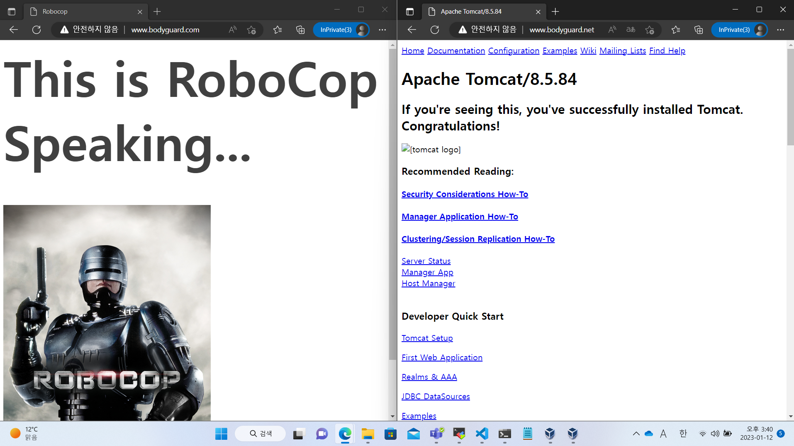

# 20230109

## 1. Tomcat 환경변수 경로 추가

[1월 6일자 4. 에 정의한 내용](https://github.com/wjsuk/dailyreport/blob/main/2023-01-06.md#4-%ED%99%98%EA%B2%BD%EB%B3%80%EC%88%98-%EC%84%A4%EC%A0%95%EC%9C%BC%EB%A1%9C-%EA%B0%81-%EC%95%A0%ED%94%8C%EB%A6%AC%EC%BC%80%EC%9D%B4%EC%85%98-%EC%8B%A4%ED%96%89%EC%8B%9C-%EA%B2%BD%EB%A1%9C-%EC%83%9D%EB%9E%B5%EC%8B%9C%ED%82%A4%EA%B8%B0)의 연장이다.

```
vim ~/.bashrc

(전략)
export JAVA_HOME=/usr/local/jdk
export TOMCAT_HOME=/usr/local/tomcat
export PATH=$PATH:$APACHE2_HOME/bin:$NGINX_HOME/sbin:$JAVA_HOME/bin:$TOMCAT_HOME/bin:

source ~/.bashrc
```

## 2. 그동안 설치했던 서버 패키지 구동 자동화 스크립트

환경변수 $PATH에 각 바이너리 파일의 경로가 추가되어 있지 않다면 추가시키거나 다음 스크립트에 경로를 넣는다.

```
vim /bin/serveron

#!/bin/bash
httpd -k start                   # Apache2 web server on /usr/local/apache2/bin/
nginx                            # Nginx server on /usr/local/nginx/sbin/
startup.sh                       # Tomcat on /usr/local/tomcat/bin
firewall-cmd --add-service=http  # for main web server service
firewall-cmd --add-port=8080/tcp # Tomcat server
firewall-cmd --add-port=8008/tcp # for sub web server service
```

## 3. Nginx의 서버 블럭 리버스 프록시 설정, Tomcat 연동시키기
### i. 정의
[Apache 웹 서버에서 했던 WEB-WAS 리버스 프록싱](https://github.com/wjsuk/dailyreport/blob/main/2023-01-06.md#7-web-was-%EB%A6%AC%EB%B2%84%EC%8A%A4-%ED%94%84%EB%A1%9D%EC%8B%B1)을 Nginx에서 구현하는 과정이다.


### ii. conf/nginx.conf 파일 수정(proxy 설정 추가)

[Nginx의 서버 블럭 설정](https://github.com/wjsuk/dailyreport/blob/main/2023-01-06.md#confnginxconf-%ED%8C%8C%EC%9D%BC-%EC%88%98%EC%A0%95)에서 다음과 같이 도메인 이름마다 작동하는 개별 서버 블럭을 만들었다. 

```
    server {
        server_name bodyguard.net www.bodyguard.net;
        access_log logs/bodyguard.net.log main;
        error_log logs/bodyguard.net.error.log;

        root /usr/local/nginx/bodyguard.net/html;
        index index.html index.htm;

        location / {
            try_files $uri $uri/ =404;
        }
    }
```

이것을 프록시 파라미터 파일을 인용하는 리버스 프록시 서버 블럭으로 바꾼다.

```

    server {
        listen       80;
        server_name  bodyguard.net www.bodyguard.net;
        access_log   logs/bodyguard.net.log        main;
        error_log    logs/bodyguard.net.error.log;

        # root         /usr/local/nginx/bodyguard.net/html;
        # index        index.html index.htm; ## bodyguard.net으로 수신한 신호에 답할 때 쓰던 HTML 파일 비활성화

        location / {
            # try_files $uri $uri/ =404; ## 기존 index.html 파일 찾기 비활성화
            include proxy_params;
            proxy_pass http://localhost:8080;
        }
    }
```

하위 블럭 location 아래에 proxy_params라는 파일을 안는 명령과,  
실제로 연동시킬 서비스의 경로를 포함한 명령 proxy_pass를 추가시킨다.  
위 파일에서는 Tomcat 서비스를 구동하는 포트가 8080번 포트이므로 localhost:8080 으로 작성하였다. 

그리고 /conf/proxy_params 라는 파일을 만들어 다음을 입력한다.

```
proxy_set_header X-Real-IP $remote_addr;
proxy_set_header X-Forwarded-For $proxy_add_x_forwarded_for;
proxy_set_header Host $http_host;
proxy_set_header X-NginX-Proxy true;

client_max_body_size 100M;
client_body_buffer_size 1m;
proxy_intercept_errors on;
proxy_buffering on;
proxy_buffer_size 128k;
proxy_buffers 256 16k;
proxy_busy_buffers_size 256k;
proxy_temp_file_write_size 256k;
proxy_max_temp_file_size 0;
proxy_read_timeout 300;
proxy_redirect off;
```

위 내용은 proxy_params 파일을 따로 만들지 않는다면  
conf/nginx.conf에서 include proxy_params 명령 대신 넣어 작동시켜도 된다.

### iii. Nginx 서버 재구동

```
nginx -t
nginx -s reload
```

이상의 과정을 마치면 www.bodyguard.net:80 도메인 이름을 접속했을 때 8080 포트의 Tomcat 초기 화면이 나오는 것을 확인할 수 있다.

### iv. Nginx 프록시 구동 성공 사례 갈무리



### v. 레퍼런스

http://areumgury.blogspot.com/2016/08/nginx.html  
https://phsun102.tistory.com/45

## 4. Mysql binary install

### i. 바이너리 설치 사전작업
#### gcc, gcc-c++, make

```
dnf install gcc gcc-c++ make -y
```

#### xz

xz는 2010년대부터 사용되고 있는 압축 프로그램으로 컴파일 설치 또는 dnf 설치가 가능하다.  
현재 ORACLE 사에서는 Mysql을 xz 압축파일로 배포하고 있으므로 이것이 없으면 압축 해제를 진행할 수 없다.

##### dnf를 이용하는 경우

```
dnf install -y xz
```

##### 컴파일 설치를 하는 경우

다음이 공식 배포 확인 페이지이다.  
https://www.tukaani.org/xz/

그 다음 다음과 같은 명령으로 설치하면 된다.
```
wget https://www.tukaani.org/xz/xz-5.4.0.tar.gz
tar -zxvf xz-5.4.0.tar.gz
cd xz-5.4.0
./configure
make && make install
```

##### xz를 이용한 압축 및 압축 해제 방법 

다음과 같이 압축을 푼다.  
압축 해제시 원래 압축파일은 삭제된다.

xz fun         # 압축을 실시하는 명령
xz -d fun.xz  # 압축을 해제하는 명령

#### ncurses
C 및 C++로 이루어진 프로그램을 TUI 또는 GUI로 표현해 주는 라이브러리이다.

##### dnf를 이용하는 경우
```
dnf install ncurse* -y
```

##### 컴파일 설치를 하는 경우

다음이 공식 배포 페이지이다.  
https://invisible-island.net/ncurses/ncurses.html

그리고 다음과 같은 설치 과정을 거친다.
```
wget https://invisible-island.net/datafiles/release/ncurses.tar.gz
tar -zxvf ncurses.tar.gz
cd ncurses-6.3
./configure --with-shared --enable-widec 
make && make install
```

##### 트러블 슈팅: Mysql이 libtinfo.so.5 파일을 찾아내 열지 못하는 경우

후술할 Mysql 설치 이후 접속 시험을 할 때 발생한다.  
따라서 다음에 나오는 Mysql 설치 과정을 거친 후 확인한다.  

```
mysql: error while loading shared libraries: libtinfo.so.5: cannot open shared object file: No such file or directory
```

/usr/lib 디렉토리에 libtinfo.so.5 파일이 없다는 내용이다.  
Mysql은 ncurses 버전 5만 인식하는데 2023년 1월 현재 업데이트된 stable 버전은 6이기 때문.  

```
./configure --with-shared --enable-widec 
```

configure 스크립트 파일 실행시 위 옵션을 포함하는 것을 알 수 있을 것이다.  
/ncurses-6.3/INSTALL 파일에서 with-shared 설정을 추가해야만 lib 디렉토리에 .so 파일이 생성된다고 안내하고 있다.  
별도의 설정을 하지 않는다면 lib 디렉토리에는 a파일밖에 생성되지 않는다.  

또한 enable-widec 설정을 추가하지 않으면 후술할 libncursesw 파일이 생성되지 않는다.  

따라서 스크립트 파일 실행시에는 반드시 **with-shared** 옵션과 **enable-widec** 설정을 추가하라.

위 설정에 따라 만들어진 /usr/lib 디렉터리 내 하위 파일 중 다음 파일을 확인할 수 있다.

```
libncursesw.so.6.0
```

위 파일의 스테이틱 링크 파일로  
libncurses.so.5 파일과 libtinfo.so.5 파일을 만든다.

```
ln -s libncursesw.so.6.0 libncurses.so.5
ln -s libncursesw.so.6.0 libtinfo.so.5
```

그리고, 이렇게 하였는데도 에러메시지가 나온다면,  
환경변수로 /usr/lib 경로를 추가한다.  

```
echo "export LD_LIBRARY_PATH=$LD_LIBRARY_PATH:/usr/lib:" >> ~/.bashrc
source ~/.bashrc
```

### ii. Mysql 패키지 입수

공식 배포 확인 페이지  
https://www.mysql.com/downloads/

'Download Archives'→'Community Server'→'linux - generic'→'x86 64-bit'를 찾아 다운로드한다.  
그 결과 나오는 페이지는 이 곳이다.  
https://downloads.mysql.com/archives/community/

```
wget https://downloads.mysql.com/archives/get/p/23/file/mysql-8.0.30-linux-glibc2.12-x86_64.tar.xz  
```

### iii. 패키지 아카이브 및 압축 해제

xz를 설치하지 않았다면 xz 설치 해설란으로 돌아가라.  

```
xz -d mysql-8.0.30-linux-glibc2.12-x86_64.tar.xz  
tar -xvf mysql-8.0.30-linux-glibc2.12-x86_64.tar  
mv mysql-8.0.30-linux-glibc2.12-x86_64 /usr/local/mysql
```

### iv. Mysql 계정 및 권한 설정, 경로 간소화

설치에 앞서 [Nginx 당시와 마찬가지로](https://github.com/wjsuk/dailyreport/blob/main/2023-01-05.md#v-nginx-%EC%84%A4%EC%B9%98) Mysql 설치 및 구동에만 관여하는 계정을 만든다.

```
useradd -r mysql -s /bin/false
```

그리고 mysql 그룹의 mysql 계정이 생성되면, 
먼저 하위 파일 모두를 포함한 소유자를 mysql:mysql로 바꾼다.
압축을 푼 mysql 디렉터리를 희망하는 경로(/usr/local/mysql 등)로 이동시킨다.   
그렇게 만든 mysql 디렉터리 하위에 mysql 그룹 및 계정 소유의 디렉터리 mysql-files 를 생성시킨다.

```
mv /usr/local/mysql
chown -R mysql:mysql /usr/local/mysql
mkdir /usr/local/mysql/mysql-files
chown mysql:mysql /usr/local/mysql/mysql-files
chmod 750 /usr/local/mysql/mysql-files
```  

/usr/local/mysql 경로는 [그동안 다른 패키지와 마찬가지](https://github.com/wjsuk/dailyreport/blob/main/2023-01-06.md#4-%ED%99%98%EA%B2%BD%EB%B3%80%EC%88%98-%EC%84%A4%EC%A0%95%EC%9C%BC%EB%A1%9C-%EA%B0%81-%EC%95%A0%ED%94%8C%EB%A6%AC%EC%BC%80%EC%9D%B4%EC%85%98-%EC%8B%A4%ED%96%89%EC%8B%9C-%EA%B2%BD%EB%A1%9C-%EC%83%9D%EB%9E%B5%EC%8B%9C%ED%82%A4%EA%B8%B0)로 환경변수 등록이 가능하다.

```
vim ~/.bashrc

(문서 최하단에)
export MYSQL_HOME=/usr/local/mysql
export PATH=(중략):$MYSQL_HOME/bin:

source ~/.bashrc
```

이후 과정은 환경변수 경로 등록을 마쳤다는 전제하에 작성하였다.

### v. Mysql 설치
```
mysqld --initialize  --user=mysql
mysql_ssl_rsa_setup
cp $MYSQL_HOME/support-files/mysql.server /etc/init.d/mysql.server # 선택사항
```

mysqld 명령 실행시에는 다음과 같이 임시 비밀번호가 나온다.  
공백 직후에 나오는 문자열을 미리 받아 적는다.

```
2023-01-09T09:59:03.487004Z 6 [Note] [MY-010454] [Server] A temporary password is generated for root@localhost: @b@ete-y@lu!!
```

그리고 터미널 창을 하나 더 열어 보안 파일을 가동시킨다.

```
mysqld_safe --user=mysql &
```

### vi. Mysql 서버 서비스 점검 및 초기 설정

다 실행시켰으면 support-files 디렉토리나 그것을 복사시켜 둔 경로의 mysql.server 파일로  
Mysql 서버를 가동시킨다.

```
(경로 생략)/mysql.server start
```

혹시 '호스트 이름.pid' 파일 생성 없이 서버 가동이 중단되었다는 에러가 나온다면,  
ps -ef | grep mysql 명령으로 mysql 이 사용하는 PID를 찾아낸 뒤,  
kill -9 (mysql PID) 명령으로 mysql의 프로세스를 강제종료시킨다.  
그 다음 mysql 하위 디렉터리 가운데 최소 data 디렉터리와 mysql-files 디렉터리의 소유자를 mysql:mysql로 바꾸고,  
권한 또한 750 이상으로 변경한다.  
재시도 후에도 동일한 에러가 나온다면 mysql 디렉터리를 포함한 하위 파일 전체 권한을 750 이상으로 변경한 뒤 재시도한다.  

```
Starting MySQL SUCCESS!
```

다음의 메시지가 나오면 가동에 성공한 것이다.  
후술할 데이터베이스 접속 명령을 위 과정보다 먼저 하지 않도록 주의할 것.  
위 과정을 진행할 수 없으며 접속 자체가 불가능하다.

데이터베이스 접속은 다음과 같이 한다.

```
mysql -u root -p
```

이후 나오는 비밀번호 입력창에 mysqld 명령 실행 직후 받은 임시 비밀번호를 입력한다.  

```
Enter password:@b@ete-y@lu!!
```

프롬프트가 mysql> 로 바뀌었다면 성공한 것이다.  
그러나,  

```
ERROR 1045 (28000): Access denied for user 'root'@'localhost' (using password: YES)
```

위 에러가 나온다면 비밀번호를 틀렸거나,  
앞서 실시해야 하는 데이터베이스 서버 가동을 결략한 것이다.

임시 비밀번호 대신 정식으로 사용할 비밀번호를 설정하려면,  
데이터베이스 서버 접속 후 다음과 같이 한다.  

```
ALTER USER 'root'@'localhost' IDENTIFIED WITH mysql_native_password BY 'kukulu_pinpon';
```

*kukulu_pinpon* 자리에 사용 희망하는 비밀번호 문자열을 넣으면 된다.


### vii. 참고자료 및 레퍼런스
https://stackoverflow.com/questions/9809213/what-are-a-and-so-files  
https://lahuman.github.io/redhat8_mysql_libtinfo.so.5/  

https://www.baeldung.com/linux/xz-compression  
https://storycompiler.tistory.com/116   
https://dev.mysql.com/doc/refman/8.0/en/binary-installation.html  
https://dev.mysql.com/doc/refman/8.0/en/starting-server.html  
https://dev.mysql.com/doc/refman/8.0/en/default-privileges.html  
https://xinet.kr/?p=2149  
https://velog.io/@vas-y-somi/MySQL-ERROR-1045-28000  
https://www.hivelocity.net/kb/how-to-start-stop-and-restart-mysql-server/  
https://blog.naver.com/PostView.naver?blogId=playhoos&logNo=221505255355  
https://rayner.tistory.com/2  
https://velog.io/@youjung/mysql-ERROR-The-server-quit-without-updating-PID  
https://www.upchris.com/archives/607  
https://extbrain.tistory.com/41
https://stackoverflow.com/questions/17005654/error-while-loading-shared-libraries-libncurses-so-5  
https://vip00112.tistory.com/23