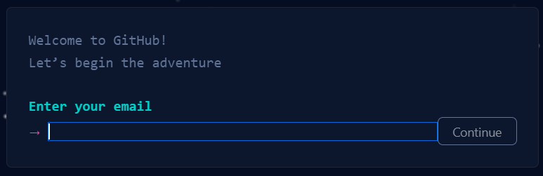
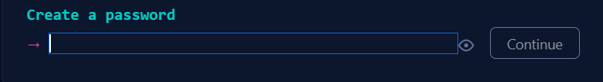
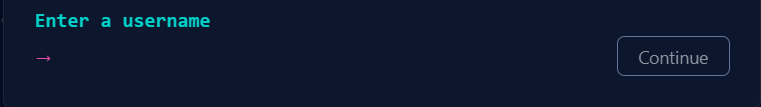
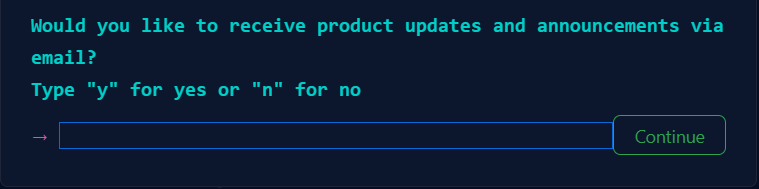
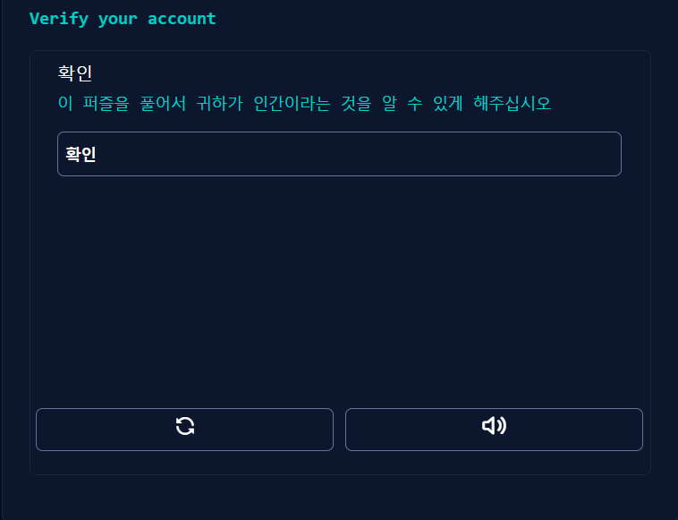
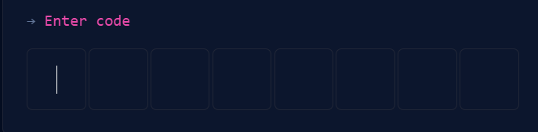
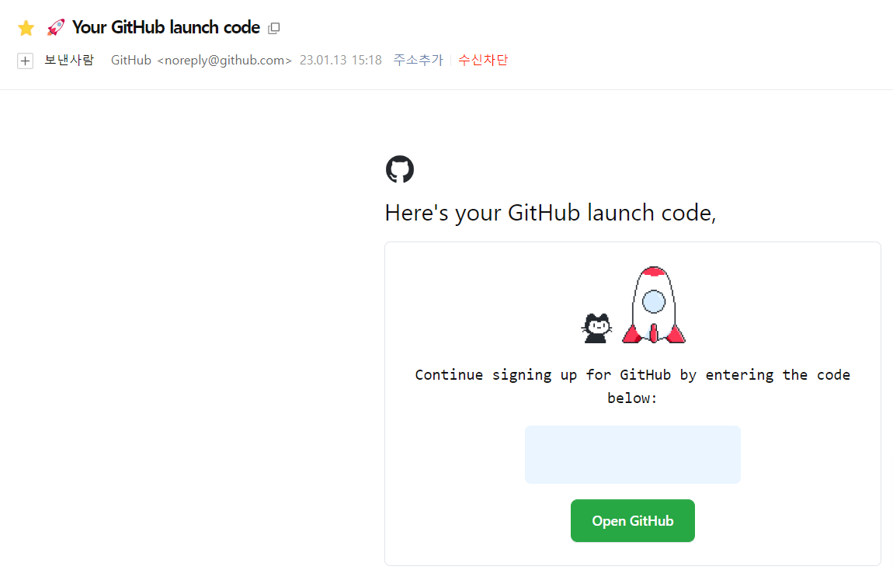
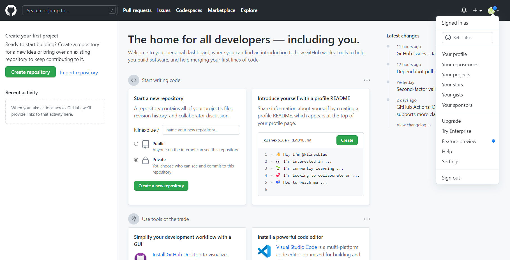

Github에 md 파일을 작성 및 업로드하는 방법
=======================================
[상위 문서로 돌아가기](How%20to%20write%20and%20upload%20markdown%20file%20to%20Github.md)  

---

# Github 가입

---

## 공식 홈페이지 링크
https://github.com/  

---

## 가입 절차
우상단의 'Sign up' 단추를 누릅니다.  

화면이 바뀌며 이메일을 묻는 프롬프트 창이 나옵니다.  
Continue 단추를 누를 때마다 이메일, 비밀번호, 아이디 순으로 입력합니다.  

이메일을 통한 업데이트 수신희망여부를 묻는 프롬프트 창이 나옵니다.  
희망여부에 따라 y나 n 글쇠를 누르고 Continue 단추를 눌러 진행합니다.  

'확인' 단추를 눌러 CAPTCHA 퍼즐을 풉니다.  

다음과 같이 인증번호를 제출하는 창이 나옵니다.  
앞 단계에서 쓴 이메일 주소의 메일함을 확인한 뒤 github 명의로 온 메일을 열어 인증번호를 앞 창에 입력합니다.  

---

## 가입 이후 조치
개인 설문조사를 하는 질문지가 나옵니다.  
원치 않으시면 건너뛰어도 되는 과정입니다. 이 경우 화면 하단의 'Skip Personalization'을 눌러 건너뜁니다.  

질문지에 응답하신 경우 이 화면에선, 과금 옵션이 필요하지 않다면 왼쪽 옵션을 누르시면 됩니다.  
선택 단추는 글자 상자의 최하단에 있습니다.  

우상단 기본 프로필 사진을 누르면 개인 설정 메뉴가 드롭다운됩니다.  

---

# [맨 위로 돌아가기](#github-가입)

