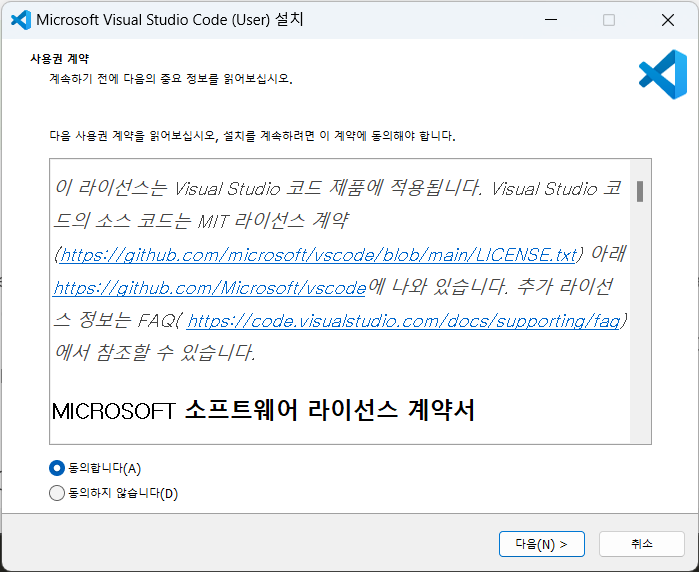

Github에 md 파일을 작성 및 업로드하는 방법
=======================================
[상위 문서로 돌아가기](How%20to%20write%20and%20upload%20markdown%20file%20to%20Github.md)  

---

# Visual Studio Code와 Github 확장도구 설치

## Visual Studio Code 다운로드 및 설치

이곳에서 운영체제에 맞는 판을 골라 다운로드하고,  
설치파일을 실행시킵니다. 클릭시 화면이 바뀌며 자동 다운로드가 시작됩니다.    

처음 화면에서는 '동의합니다'를 누릅니다.

설치가 끝나면 Visual Studio Code 실행 체크박스를 누른 채로 설치를 마칩니다.  

---

## Github 동기화를 위한 Visual Studo Code 초기 설정

Visual Studio Code가 실행되면,  
원하는 테마를 클릭하고 좌상단을 누릅니다.  

그리고 좌측 하단의 퍼즐 조각 모양 단추를 눌러,  
나오는 검색창에 'Github'를 검색합니다.  

그리고 최상단의 어플리케이션을 인스톨합니다.

Ctrl+S 단축키를 누르거나 상단 메뉴의 File>Save를 누르면 파일이 저장됩니다.  
이때 새로운 파일을 만들었거나, 기존 파일을 수정했을 경우  
동기화한 git 레포지토리와의 차이가 생긴 것을 VScode가 감지합니다.  

이 변화가 감지된 이후 좌측 메뉴의 포도송이 모양 아이콘을 누르면,  
동기화한 레포지토리 파일 내용과 달라진 파일 목록과 Commit 단추가 보입니다.  
이 곳은 재동기화 메뉴입니다.  

Commit 단추 바로 위 입력창에 어떤 변화가 있었는지 적습니다.  
최대 글자수 제한이 적은 편이므로 간단히만 적는 것을 권해 드립니다.  

그리고 commit 단추를 누릅니다.

그러면 다음과 같은 경고문이 나올 것입니다.  
그동안 저장하지 않았던 작업까지 저장 후 동기화에 반영하는 것을 확인하기 위함입니다.  
여기서 가장 왼쪽 단추를 누릅니다.  

그리고 

git config --global user.email "krinexblue@hanmail.net"
git config --global user.name "klinexblue"

---

# [맨 위로 돌아가기](#visual-studio-code와-github-확장도구)

